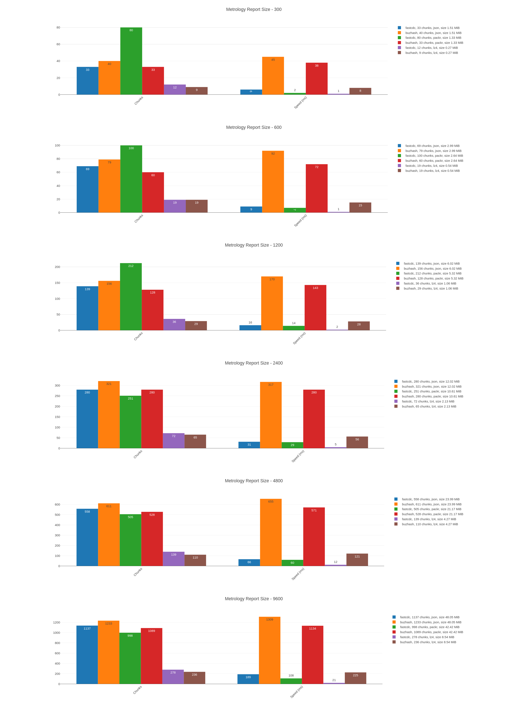

# Chunking speed benchmark

Webpack (browser) based benchmark for two content defined chunking algorithms: `fastcdc` and `buzhash`. For efficiency the chunking module is written in [rust](https://github.com/dstanesc/wasm-chunking-eval) and compiled in web assembly

The project uses [synthetic metrology data](https://www.npmjs.com/package/@dstanesc/fake-metrology-data) for data generation and [wasm-chunking-webpack-eval](https://www.npmjs.com/package/@dstanesc/wasm-chunking-webpack-eval) for chunking.

The binary data is derived from raw metrology reports in three ways: [json text encoding](https://developer.mozilla.org/en-US/docs/Web/API/TextEncoder), [msgpack encoded](https://www.npmjs.com/package/msgpackr) and combined msgpack encoded plus [lz4 compressed](https://www.npmjs.com/package/lz4)

> Info: We did not test other compression algorithms as _content defined chunking_ loses stability (ie. ability to substantially reuse chunks after minor changes applied to the data). A different evaluation will look into the chunk reuse matrix (chunking algorithms vs. binary data formats vs. data size) but undocumented insights reveal `lz4` ability to provide a substantial reuse ratio coupled with acceptable compression.

## Execute Benchmark

```
npm run clean // optional
npm install
npm run build
npm start
```

A browser page will open and guide the execution.

##  Example Results



